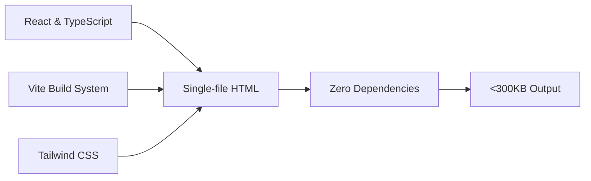

# ⚡ Playable Ads Engine

### *The fastest way to ship high-performance playable ads*

**Most studios skip playables because they take 3-4 weeks and cost $10K+ from agencies.**  
We're solving that with a **generative engine** that produces production-ready playables in **<24 hours**.

[📧 Join Closed Beta](#-currently-in-closed-beta) • [🎮 View Demos](#-generated-demos) • [💡 Why This Matters](#-why-this-matters)

---

## 🎯 What We're Building

> A system that creates **fully custom playables from the ground up** using just a text prompt and a gameplay video clip.

**No templates. No pre-built assets. Every playable is uniquely generated for your game.**

<table>
<tr>
<td width="50%">

### 📥 **Input**
- Simple text description
- Gameplay video of core mechanic

</td>
<td width="50%">

### 📤 **Output**
- Production-ready playable ad
- Delivered in <24 hours

</td>
</tr>
</table>

### ✨ Every Generated Playable Includes:

| Feature | Specification |
|---------|--------------|
| 📦 **File Size** | <300KB (loads in <0.3s, even on 3G) |
| 🌐 **Compliance** | MRAID, Meta, TikTok, Google, Vungle, and more |
| 🎮 **Mechanics** | Fully custom (not generic templates) |
| 📈 **Optimization** | Built for conversion, not just clicks |

---

## 🚀 Generated Demos

**Below are real outputs from our engine. Each playable is fully custom-built from scratch—**  
**generated from a text prompt and gameplay video clip. Zero templates, zero shortcuts.**

 

### 💎 Gem Matcher

  

> *Classic match-3 mechanics with instant gratification loops*

**[▶️ PLAY LIVE DEMO](https://heyrtl.github.io/playable-ads-portfolio/ads/gem-matcher/)**

| Metric | Value |
|--------|-------|
| 📦 File Size | `176 KB` |
| ⚡ Load Time | `<0.3s` |
| 🛠️ Tech Stack | React, TypeScript, Vite, Tailwind CSS |

 

---

### 🐉 Dragon Merge

  

> *Addictive merge progression with mythical creatures*

**[▶️ PLAY LIVE DEMO](https://heyrtl.github.io/playable-ads-portfolio/ads/dragon-merge/)**

| Metric | Value |
|--------|-------|
| 📦 File Size | `241 KB` |
| ⚡ Load Time | `<0.3s` |
| 🛠️ Tech Stack | React, TypeScript, Vite, Tailwind CSS |

 

---

### 🍪 Cookie Empire

  

> *Hyper-casual idle clicker with explosive growth curves*

**[▶️ PLAY LIVE DEMO](https://heyrtl.github.io/playable-ads-portfolio/ads/cookie-empire/)**

| Metric | Value |
|--------|-------|
| 📦 File Size | `188 KB` |
| ⚡ Load Time | `<0.3s` |
| 🛠️ Tech Stack | React, TypeScript, Vite, Tailwind CSS |
| ✨ Features | MRAID compliant, MMP event tracking |

 

---

### 📝 WordMatch

  

> *Fast-paced bilingual word puzzles with instant feedback*

**[▶️ PLAY LIVE DEMO](https://heyrtl.github.io/playable-ads-portfolio/ads/wordmatch-es/)**

| Metric | Value |
|--------|-------|
| 📦 File Size | `198 KB` |
| ⚡ Load Time | `<0.2s` |
| 🛠️ Tech Stack | React, TypeScript, Vite, Tailwind CSS |
| ✨ Features | MRAID v2.0 compliant |

 

---

### ❄️ Frost World

  

> *Resource gathering meets survival mechanics in a frozen world*

**[▶️ PLAY LIVE DEMO](https://heyrtl.github.io/playable-ads-portfolio/ads/frost-world/)**

| Metric | Value |
|--------|-------|
| 📦 File Size | `258 KB` |
| ⚡ Load Time | `<0.3s` |
| 🛠️ Tech Stack | React, TypeScript, Vite, Tailwind CSS |
| ✨ Features | MRAID v2.0 compliant |

 

---

### 🎯 Bubble Shooter

  

> *Classic arcade bubble-popping with precision aiming mechanics*

**[▶️ PLAY LIVE DEMO](https://heyrtl.github.io/playable-ads-portfolio/ads/bubble-shooter/)**

| Metric | Value |
|--------|-------|
| 📦 File Size | `151 KB` |
| ⚡ Load Time | `<0.3s` |
| 🛠️ Tech Stack | React, TypeScript, Vite, Tailwind CSS |
| ✨ Features | MRAID v2.0 compliant |

 

---

### 🧩 Block Puzzle

  

> *Strategic block placement with satisfying chain-clear mechanics*

**[▶️ PLAY LIVE DEMO](https://heyrtl.github.io/playable-ads-portfolio/ads/block-puzzle/)**

| Metric | Value |
|--------|-------|
| 📦 File Size | `299 KB` |
| ⚡ Load Time | `<0.3s` |
| 🛠️ Tech Stack | React, TypeScript, Vite, Tailwind CSS |
| ✨ Features | MRAID v2.0 compliant |

 

---

## 💡 Why This Matters

### **The bottleneck in mobile UA isn't the creative idea—it's execution speed.**

Traditional agencies take **weeks** and charge **$10K+** per playable. Our engine delivers production-ready ads in **under 24 hours**, letting you test more creatives, iterate faster, and find winners before your competitors do.

 

<table>
<tr>
<td width="50%" valign="top">

### 📊 **Built for Performance Marketers**

- ⚡ **Instant load times** on 3G networks  
  *(no user drop-off)*

- 🌐 **Universal ad network support**  
  *(deploy anywhere)*

</td>
<td width="50%" valign="top">

### 🎯 **Optimized for Results**

- 📈 **Conversion-optimized mechanics**  
  *(not just pretty demos)*

- ✅ **Production-ready output**  
  *(no additional dev work needed)*

</td>
</tr>
</table>

---

## 🛠️ Technical Foundation

**Our engine outputs modern, highly-optimized web applications**

 

 

| Component | Technology |
|-----------|-----------|
| 🎨 **Frontend** | React & TypeScript |
| ⚙️ **Build System** | Vite with aggressive optimization |
| 💅 **Styling** | Tailwind CSS (purged for minimal footprint) |
| 📦 **Output Format** | Single-file HTML (zero dependencies) |

---

## 🚀 Currently in Closed Beta

**We're working with select game studios and performance marketers running in-app ads (IAA) user acquisition.**

 

### 💬 If you're running mobile UA and want to test playables faster than any agency can deliver:

 

 

---

 

*Built by someone who worked with studios running IAA-based user acquisition*  
*and got tired of watching creative execution bottleneck the entire funnel.*

